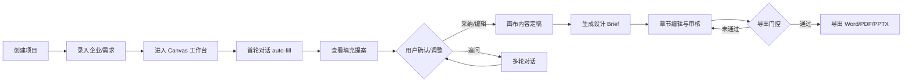

# 售前智能咨询方案专家助手 — 交付验收规格 (PRESALE_DELIVERY_SPEC)

> **版本**: 1.0  
> **日期**: 2026-07-18  
> **状态**: 待验收  
> **定位**: 本文档是面向**产品内容完整验收**的权威规格，定义从「用户输入企业信息」到「多轮对话引导」再到「设计方案出版（导出）」的全链路要求。  
> **关系**: 继承 [PROJECT_SPEC.md](./PROJECT_SPEC.md) 的产品目标，收敛 [AGENT_SPEC.md](./AGENT_SPEC.md) 的 Agent 行为，对齐当前 **Canvas 工作台** 实现形态（非旧版 6 Tab 流程）。

---

## 1. 验收总目标

### 1.1 一句话定义

**用户输入企业信息与项目需求后，系统基于 SOP、内部知识库与受控联网搜索，通过多轮对话引导用户补全关键信息、调整方案内容，最终产出经人工审核、可追溯来源、可导出的合格售前设计方案。**

### 1.2 验收范围（In Scope）

| 维度 | 验收要求 |
|------|----------|
| 输入 | 结构化项目向导 + 对话补充 + 资料上传 |
| 过程 | SOP 驱动、多轮对话、缺失信息引导、节点/章节级编辑 |
| 知识 | 案例库、文档 RAG、SOP、模板、技术/质量规则、受控 web_search |
| 产物 | 企业画像（画布）、策划案（设计 Brief）、视觉 Prompt（可选）、导出文件 |
| 质量 | 不编造案例/报价/参数；引用可追溯；待确认项显式标记 |
| 审核 | 章节/节点级人工审核；导出门控 |
| 交付 | Word / PDF / PPTX 导出；项目状态可追踪 |

### 1.3 明确不做（Out of Scope — 本版验收不要求）

- 外部客户自助门户完整实现
- 多租户 / 付费 / 技能市场 ToC 版
- 自动报价、施工图、最终投屏视频
- 完整 GraphRAG / OWL 本体工程
- LLM 原生 tool-calling 全自动编排（本版采用「应用层 SOP 路由 + 旁路预检索」）

---

## 2. 产品形态

### 2.1 主界面

**项目驱动的 Canvas 工作台**，不是纯 ChatGPT 式聊天页。

```text
/workspace/canvas/{projectId}
├─ 左侧：项目对话面板（多轮引导、搜索可见、采纳/确认）
├─ 中央：无限画布（三大板块 + 节点内容 + 溯源）
└─ 右侧：版本面板（快照、恢复、导出）
```

辅助入口：

- `/workspace/projects/new` — 创建项目向导（结构化录入）
- `/admin/*` — 知识库与 SOP 运营后台

### 2.2 交互原则

1. **对话是引导手段，产物是交付目标** — 聊出来的内容必须落到结构化 Artifact（画布节点、策划案章节），不能只留在气泡里。
2. **SOP 决定步骤顺序与检查项** — 不由代码硬编码 Prompt/SOP。
3. **缺什么问什么** — 关键信息缺失时标记「⚠️ 需要进一步确认」，禁止编造。
4. **直出成品，缺料才提示** — AI 默认输出可用文案，而非「建议你这样写」。
5. **人确认后才出版** — 导出前必须通过审核门控。

---

## 3. 目标用户与角色

| 角色 | 本版验收关注点 |
|------|----------------|
| 销售 | 创建项目、首轮输入、查看填充结果、导出给客户 |
| 策划 | 编辑策划案章节、确认案例引用、补充创意方向 |
| 设计 | 生成视觉 Prompt / 概念图（P1，非阻塞主链） |
| 审核 | 章节审核、风险/报价类确认、放行导出 |
| 管理员 | 维护 SOP、案例、模板、规则 |

> **本版权限**：登录用户可访问全部功能（RBAC 细粒度为后续 Phase）。验收时至少区分 **admin** 与 **普通用户** 可登录使用。

---

## 4. 端到端用户旅程

### 4.1 旅程 ID：`presale_main_flow`



### 4.2 阶段定义

| 阶段 ID | 名称 | 触发条件 | 系统行为 | 用户动作 | 产出 |
|---------|------|----------|----------|----------|------|
| `S1` | 项目创建 | 用户点击新建 | 向导收集结构化信息；创建 Project + Company + Canvas V1 + 绑定 Conversation | 填写 6 步表单 | `project_id`, `conversation_id`, `version_id` |
| `S2` | 资料准备 | 可选 | 上传 PDF/PPT/图片；解析入库 | 上传资料 | `documents[]`, `document_chunks[]` |
| `S3` | 首轮采集 | 项目对话**第一条**非寒暄消息 | 加载 SOP → web_search → fill_canvas → 可见化 `canvas_fill_proposal` → proposal_generation | 输入企业名+需求描述 | 画布三大板块初稿 + 策划案初稿 |
| `S4` | 多轮引导 | 后续消息 | 按意图路由：问答 / 节点编辑 / Skill / 新资料归档 | 追问、补充、指定节点修改 | 更新节点/Brief；`missing_info` 收敛 |
| `S5` | 人工精修 | 用户主动 | 画布手动编辑；策划案章节编辑；节点 adopt | 编辑、采纳、保存版本 | `ProjectVersion` 快照 |
| `S6` | 审核 | 内容就绪 | 章节状态 `draft → review → approved`；风险/报价章节强制人工确认 | 审核通过/驳回 | `sections_meta[].status` |
| `S7` | 出版 | 用户请求导出 | 质量检查 → 生成文件 → 更新项目状态 | 选择格式导出 | `export_file` |

### 4.3 SOP 驱动规则

每个项目根据 **行业 + 项目类型 + 场景** 匹配一条 `sop_workflows` 记录：

```yaml
sop_match:
  inputs: [industry, project_type, scene]
  output: sop_workflow_id, version
  fallback: default_presale_sop
```

SOP `steps_json` 定义：

- 步骤顺序（企业解析 → 案例检索 → 方案生成 → 质量检查 → …）
- 每步 `rules`（禁止编造、必须引用案例、require_human_review 章节列表）
- 每步 `checklist_json`（导出前检查项）

**验收要求**：生成策划案时必须记录 `used_sop_version`；导出前检查项来自 SOP `quality_review` 步骤，不得写死在代码中。

---

## 5. 输入规范

### 5.1 结构化输入（项目向导）

路径：`/workspace/projects/new`

| 步骤 | 字段 | 必填 | 用途 |
|------|------|------|------|
| 基本信息 | 项目名称、客户企业名、行业、项目类型、需求描述 | 项目名、客户名 | 项目元数据、SOP 匹配 |
| 企业调研 | 官网、企业描述、竞品、目标市场 | 否 | 企业解析补充 |
| 场地与屏幕 | 屏幕类型、尺寸、点距、安装环境、观看距离、主观看点 | 否（但影响方案质量） | 技术规则校验、待确认项 |
| 方案风格 | 方案风格、语言、语调、必要章节 | 否 | 模板选择 |
| 视觉要求 | 视觉风格、色系、出图数量 | 否 | 视觉阶段（P1） |
| 审核与导出 | 质量等级、审核维度、导出格式 | 否 | 导出门控配置 |

### 5.2 对话输入

| 输入类型 | 示例 | 系统响应 |
|----------|------|----------|
| 首轮需求 | 「给华为做一个裸眼 3D 幕墙发布方案」 | 触发 `S3` auto-fill 全流程 |
| 自由问答 | 「裸眼 3D 和 LED 幕墙有什么区别？」 | conversational + web_search，直接回答 |
| 节点编辑 | 选中「品牌定位」节点：「帮我补充」 | node_edit：直出成品 + `node_draft` + 采纳按钮 |
| 明确 Skill | 「导出 PDF」「检索类似案例」 | 路由到对应 Skill |
| 寒暄 | 「你好」 | 固定礼貌回复，不触发 pipeline |
| 资料引用 | 消息含 `[ref_doc:uuid]` | 解析文档 chunk 进上下文 |

### 5.3 最低可运行输入（MVP 门槛）

验收用例必须证明：**仅提供「企业名称 + 一句话需求」** 也能走通 S3→S4→S7，但输出中必须包含 `missing_info`（屏幕参数、预算等）。

---

## 6. 产物模型（Artifact）

### 6.1 产物类型一览

| artifact_type | 存储载体 | 说明 |
|---------------|----------|------|
| `company_profile_canvas` | `CanvasNode.content` + `NodeSource` | 三大板块节点内容（extracted/planning/ui_suggestion/pending_questions） |
| `design_brief` | `GenerationOutput` / Skill 输出 / `proposal_section` block | 策划案，即「设计 Brief」 |
| `visual_prompt` | Skill 输出 / 对话 rich_content | 视觉策略 + 正负向 Prompt（P1） |
| `visual_image` | 图片存储 + GenerationOutput | 概念图（P1） |
| `export_file` | 文件存储 + 导出记录 | Word / PDF / PPTX |

### 6.2 画布节点内容结构

```json
{
  "extracted": ["从资料/搜索提取的原始要点"],
  "planning": ["AI 整理后的成品售前文案"],
  "ui_suggestion": ["UI/视觉建议，可选"],
  "pending_questions": ["⚠️ 需要进一步确认：屏幕尺寸"]
}
```

**节点状态**：`draft → filling → filled | pending_review`

### 6.3 策划案（设计 Brief）章节结构

默认章节（可由 `proposal_templates` 配置）：

| 序号 | 章节 key | 标题 | require_human_review |
|------|----------|------|----------------------|
| 1 | understanding | 需求理解 | false |
| 2 | company_summary | 企业解析摘要 | false |
| 3 | background | 项目背景 | false |
| 4 | objectives | 项目目标 | false |
| 5 | creative_theme | 创意主题 | false |
| 6 | highlights | 方案亮点 | false |
| 7 | visual_direction | 视觉方向 | false |
| 8 | reference_cases | 参考案例 | false |
| 9 | implementation | 实施建议 | false |
| 10 | risks | 风险与待确认事项 | **true** |

每章节 `sections_meta` 字段：

```json
{
  "order": 1,
  "key": "understanding",
  "title": "需求理解",
  "content": "...",
  "status": "draft | review | approved",
  "require_human_review": false,
  "reviewed_by": null,
  "reviewed_at": null,
  "used_cases": ["case-uuid"],
  "missing_info": []
}
```

### 6.4 溯源（Provenance）— 所有 AI 产物必含

```json
{
  "used_cases": ["uuid"],
  "used_documents": ["uuid"],
  "used_chunks": ["uuid"],
  "used_external_sources": [
    {
      "title": "...",
      "url": "https://...",
      "domain": "...",
      "snippet": "...",
      "source_type": "web_search",
      "confidence": "high | medium | low"
    }
  ],
  "used_sop_version": "sop_id@1.0.0",
  "used_prompt_templates": ["template_id"],
  "used_proposal_template": "template_id"
}
```

**硬性规则**：`reference_cases` 章节中的案例必须来自 `used_cases`，禁止 LLM 虚构 case_id。

---

## 7. 多轮对话与记忆

### 7.1 对话线程模型

| scope_type | 用途 |
|------------|------|
| `project` | 项目级全局对话（默认） |
| `node` | 单节点编辑对话（`scope_ref_id = node_id`） |

### 7.2 记忆分层（验收要求）

| 层 | 内容 | 验收标准 |
|----|------|----------|
| 会话记忆 | 最近 web_search 结果、Agent 状态、上轮填充摘要 | 用户追问「刚才搜到的主营业务是什么」能正确回答 |
| 项目记忆 | 画布 digest、missing_info 汇总、已确认事实 | 跨轮对话不重复询问已确认信息 |
| 知识记忆 | RAG + 案例 + SOP | 生成内容可追溯到检索日志 |

### 7.3 意图路由

| intent | 路径 | 说明 |
|--------|------|------|
| `auto_fill` | `_handle_auto_fill` | 首条消息 |
| `conversational` | `_handle_conversational` | 自由问答 |
| `node_edit` | `_handle_node_edit` | 带 node_id |
| `run_skill` | `_handle_skill_execution` | 明确 Skill 请求 |
| `sop_pipeline` | 合并到 auto_fill / skill 链 | 完整方案请求 |

### 7.4 缺失信息引导

当以下信息缺失时，系统必须：

1. 在 `pending_questions` / `missing_info` 中列出**具体项**
2. 对话中主动追问（一次不超过 3 项）
3. 标记阻断性缺失时，导出按钮禁用

**常见缺失项**：屏幕尺寸、点距、安装环境、主观看点/距离、预算范围、交付周期、品牌调性偏好。

---

## 8. 知识库与检索

### 8.1 知识资产分层

| 层级 | 来源 | 检索方式 |
|------|------|----------|
| 结构化案例 | `cases` | `case_search` 元数据过滤 + 权重 |
| 文档知识 | `document_chunks` | hybrid RAG（关键词 + 向量） |
| SOP | `sop_workflows` | `sop_load` |
| 方案模板 | `proposal_templates` | `template_load` |
| Prompt 模板 | `prompt_templates` | `prompt_template_load` |
| 视觉风格 | `visual_styles` | `visual_style_match` |
| 技术规则 | `technical_rules` | `tech_rule_query` |
| 质量标准 | `quality_rules` | `quality_rule_query` |
| 外部公开信息 | web | `web_search`（受控，见 AGENT_SPEC §2.3） |

### 8.2 检索链（Context Pack）

```text
用户需求
  → 任务识别 + SOP 步骤
  → 结构化 query（行业/场景/风格过滤）
  → 案例检索 + 文档 hybrid 检索
  → Context Pack 组装
  → LLM 生成
  → retrieval_logs 写入
```

### 8.3 web_search 边界

- **强制触发**：企业解析 / 首轮 auto-fill
- **补充触发**：conversational / node_edit 遇到事实性问题
- **禁止**：编造来源；搜索失败时标记「未核实」并继续，不阻断主链
- **可见性**：搜索整理结果必须在对话中可见（`canvas_fill_proposal` / 来源列表）

---

## 9. 审核与导出门控

### 9.1 章节审核状态机

```text
draft ──→ review ──→ approved
  ↑          │
  └──────────┘ (驳回)
```

- `require_human_review: true` 的章节必须 `approved` 才能导出
- 审核操作写入审计记录（人工编辑、状态变更）

### 9.2 导出前检查清单（来自 SOP quality_review）

| 检查项 | 阻断导出 |
|--------|----------|
| 所有章节 status = approved | 是 |
| 不存在阻断性 missing_info | 是 |
| 企业画像/画布关键节点已 filled | 是 |
| 参考案例均有有效 case_id | 是 |
| 报价/工期类内容已人工确认 | 是（若在正文中出现） |

### 9.3 导出格式

| 格式 | 优先级 | 内容 |
|------|--------|------|
| DOCX | P0 | 完整策划案 + 可选附录 |
| PDF | P0 | 同上 |
| PPTX | P1 | 摘要版 |

---

## 10. 页面与交互验收

### 10.1 必验页面

| 路径 | 验收要点 |
|------|----------|
| `/workspace/projects` | 列表、筛选、状态标签、进入 Canvas |
| `/workspace/projects/new` | 6 步向导提交成功，跳转 Canvas |
| `/workspace/canvas/[projectId]` | 三栏布局；对话+画布+版本联动 |
| `/admin/sop-workflows` | SOP 可编辑，版本生效 |
| `/admin/cases` | 案例 CRUD，质量分/权重 |
| `/admin/proposal-templates` | 模板章节可配置 |
| `/login` | 登录后可访问工作台 |

### 10.2 对话面板必验交互

- [ ] 首条消息触发 thinking 进度 + `canvas_fill_proposal` 卡片
- [ ] Proposal 卡片展示分板块要点 + 来源
- [ ] 节点对话显示成品 + 「采纳到节点」
- [ ] 采纳后画布节点刷新，status → filled
- [ ] 策划案 `proposal_section` 卡片可展开编辑
- [ ] 刷新页面后会话历史与产物不丢失
- [ ] 并发发送第二条消息返回 409（conversation lock）

### 10.3 画布必验交互

- [ ] 三大默认板块：企业介绍 / 产品技术 / 未来责任
- [ ] 节点可手动编辑并保存版本
- [ ] 节点可查看 NodeSource 溯源
- [ ] AI 填充后生成新版本快照
- [ ] 历史版本只读；恢复产生新分支版本

---

## 11. 审计与追踪（验收要求）

### 11.1 必须可追溯的操作

| 操作 | 记录载体 |
|------|----------|
| Skill 执行 | `skill_executions` |
| RAG 检索 | `retrieval_logs` |
| 节点 AI 写入 | `node_sources` + `skill_executions` |
| 人工编辑/审核 | 章节 `sections_meta` + 未来 `audit_logs` |
| 导出 | 导出任务 + 项目状态变更 |

### 11.2 验收最低标准

- 任一策划案章节可查看引用了哪些案例/文档
- 任一画布节点可查看来源类型（web_search / case / upload / ai_completed）
- `retrieval_logs` 可在管理端查询
- 导出动作有记录（谁、何时、何种格式）

> **已知差距**：chat auto-fill 全链路尚未统一 `operation_runs` 父记录；Phase 2 补齐，不阻塞本版内容验收，但阻塞「运维级排障验收」。

---

## 12. 非功能需求

| 类别 | 要求 |
|------|------|
| 部署 | Docker Compose 一键启动；见 DEPLOYMENT.md |
| 认证 | JWT 登录；生产环境禁用默认弱密码 |
| AI Provider | 支持 OpenAI-compatible LLM；开发可用 Mock |
| 并发 | 单会话串行（conversation lock）；Canvas agent-run 可异步轮询 |
| 性能 | 首条 auto-fill 90s 内返回可见结果（含 Mock）；生产依赖真实 LLM |
| 可靠性 | Skill/web_search 失败降级，不整链崩溃 |

---

## 13. 内容完整验收清单

> 验收人逐项勾选。全部 P0 通过 = **内容完整验收通过**。

### 13.1 P0 — 主链（必须通过）

#### A. 项目创建与录入

- [ ] **A1** 用户可通过向导创建项目，必填项校验生效
- [ ] **A2** 创建成功后自动进入 Canvas 工作台，存在 V1 版本与绑定对话
- [ ] **A3** 向导中的企业名、行业、需求描述可在后续生成中被使用

#### B. 首轮采集（S3）

- [ ] **B1** 首条非寒暄消息触发 auto-fill（web_search + fill_canvas + proposal）
- [ ] **B2** 对话中出现 `canvas_fill_proposal`，用户可见分板块填充结果
- [ ] **B3** 画布三大板块至少各有一个节点被写入 `planning` 内容
- [ ] **B4** 对话中出现策划案初稿（`proposal_section` 或等价 block）
- [ ] **B5** web_search 失败时流程继续，缺失项标记「未核实」
- [ ] **B6** 上传资料后，资料内容可被首轮/后续生成引用

#### C. 多轮对话（S4）

- [ ] **C1** 用户可追问，系统基于已有画布/会话上下文回答（非「失忆」）
- [ ] **C2** 自由售前问题得到直接回答，非「请去用 XX 技能」
- [ ] **C3** 节点对话直出成品文案，可「采纳到节点」
- [ ] **C4** 关键信息缺失时，列出具体 `missing_info` / `pending_questions`
- [ ] **C5** 刷新页面后，对话历史与 rich_content blocks 完整保留
- [ ] **C6** 明确请求「导出/案例检索/企业解析」等路由到正确 Skill

#### D. 知识与 SOP

- [ ] **D1** 策划案生成引用了案例库中真实案例（`used_cases` 非空时可验证）
- [ ] **D2** 文档 RAG 检索写入 `retrieval_logs`
- [ ] **D3** 生成结果记录 `used_sop_version` 或等价 SOP 引用
- [ ] **D4** 无案例匹配时不编造案例名称/虚构项目
- [ ] **D5** 技术参数（屏幕等）无依据时不写死数值

#### E. 编辑与版本（S5）

- [ ] **E1** 用户可手动编辑画布节点并保存
- [ ] **E2** 用户可编辑策划案章节内容
- [ ] **E3** 保存/确认产生新版本快照，可查看历史版本
- [ ] **E4** 恢复历史版本产生新分支，不覆盖当前版本

#### F. 审核与导出（S6-S7）

- [ ] **F1** 章节可切换 draft / review / approved
- [ ] **F2** `require_human_review` 章节未 approved 时导出被阻断并提示原因
- [ ] **F3** 全部审核通过后成功导出 DOCX 或 PDF
- [ ] **F4** 导出文件包含完整章节，非空壳
- [ ] **F5** 项目状态随流程推进可识别（如：待审核 → 已导出）

### 13.2 P1 — 增强（建议通过，不阻塞首验）

- [ ] **P1-1** 视觉 Prompt 生成 Skill 可用
- [ ] **P1-2** 图片生成（Mock 或真实 Provider）可出图
- [ ] **P1-3** PPTX 导出可用
- [ ] **P1-4** 管理后台检索测试页可验证 RAG 命中
- [ ] **P1-5** 反馈评分可保存

### 13.3 P2 — 运营与架构（后续迭代）

- [ ] 统一 `operation_runs` 全链路追踪
- [ ] 项目级角色成员与隔离上下文
- [ ] 轻量 Ontology 受控词表
- [ ] LLM function-calling 工具自主层

---

## 14. 验收测试用例

### 14.1 标准验收剧本（人工 UAT）

**剧本名称**：华为裸眼 3D 发布方案

| 步骤 | 操作 | 预期结果 |
|------|------|----------|
| 1 | 向导创建项目：客户「华为」，行业「科技」，需求「总部裸眼3D幕墙品牌发布」 | 进入 Canvas |
| 2 | 对话输入：「给华为做一个裸眼3D幕墙的方案，面向科技品牌发布」 | 触发 auto-fill，可见 proposal 卡片 |
| 3 | 检查画布 | 企业介绍/产品技术/未来责任有内容 |
| 4 | 追问：「刚才填充的企业主营业务是什么？」 | 基于已填充内容回答 |
| 5 | 选中「品牌定位」节点，输入「帮我补充品牌定位」 | 直出成品 + 采纳按钮 |
| 6 | 点击采纳 | 节点更新，有 NodeSource |
| 7 | 打开策划案，编辑「创意主题」 | 保存成功 |
| 8 | 将全部章节标记 approved | 状态更新 |
| 9 | 点击导出 PDF | 成功下载，内容完整 |
| 10 | 检查引用 | 案例/来源可追溯或明确标注待确认 |

### 14.2 自动化测试映射

| 验收项 | 测试文件 | 备注 |
|--------|----------|------|
| B1-B4 | `test_canvas_fill_proposal_sse.py` | SSE block 断言 |
| C3 | `test_node_edit_direct_output.py` | 直出 + node_draft |
| C5 | `test_conversation_persistence.py` | 刷新后持久化 |
| C6 | `test_pipeline.py` | 意图路由 |
| F2 | `test_hitl.py` | 导出门控 |
| D2 | `test_rag.py` | retrieval_logs |
| Lock | `test_conversation_lock.py` | 409 并发 |

**待建**：`test_presale_main_flow.py` — 端到端主链（见 TEST_PLAN 补充）。

---

## 15. 现状差距摘要（2026-07-18）

| 能力 | 现状 | 相对本 Spec |
|------|------|-------------|
| 项目向导 | 已实现 6 步 | ✅ 符合 |
| Canvas 工作台 | 已实现三栏 | ✅ 符合 |
| 首轮 auto-fill | 已实现 | ⚠️ 追问记忆、搜索可见性需加强 |
| 节点直出 + adopt | 已实现 | ✅ 符合 |
| 策划案生成 | 已实现 Skill | ⚠️ 章节编辑 UI 需与 Canvas 工作台深度整合 |
| 审核 HITL | 后端已有 | ⚠️ 前端审核流需走查 |
| 导出 | 已实现 | ⚠️ 门控需全链验证 |
| 会话记忆 | 部分 | ❌ 跨轮上下文不完整 |
| 统一审计 | 碎片化 | ⚠️ 内容级可追溯有，运维级追踪缺 |
| 视觉阶段 | 部分 | P1 |

---

## 16. 分期实施建议

> **实施计划:** [2026-07-18-presale-delivery.md](./superpowers/plans/2026-07-18-presale-delivery.md)（17 个 Task，4 Phase，TDD 步骤）

| Phase | 目标 | 交付物 | 对应验收项 |
|-------|------|--------|------------|
| **Phase 1** | 主链跑通 | auto-fill 稳定、proposal 可见、导出可用 | P0 A-F |
| **Phase 2** | 对话可靠 | 记忆分层、operation_runs、搜索可见 | P0 C1-C5 |
| **Phase 3** | 知识生产化 | RAG rerank、Ontology 词表、审核 UI 完善 | P0 D、P1 |
| **Phase 4** | 协作增强 | 多角色、function-calling | P2 |

---

## 17. 文档索引

| 文档 | 用途 |
|------|------|
| [PROJECT_SPEC.md](./PROJECT_SPEC.md) | 原始需求与数据模型 |
| [AGENT_SPEC.md](./AGENT_SPEC.md) | Agent/SOP/web_search 行为 |
| [UI_SPEC.md](./UI_SPEC.md) | 页面布局与组件 |
| [RAG_SPEC.md](./RAG_SPEC.md) | 检索架构 |
| [TEST_PLAN.md](./TEST_PLAN.md) | 测试策略 |
| [DEPLOYMENT.md](./DEPLOYMENT.md) | 部署与运维 |
| [2026-07-09-presale-assistant-direct-output-design.md](./superpowers/specs/2026-07-09-presale-assistant-direct-output-design.md) | 直出成品改造 |
| [2026-07-09-canvas-research-smart-fill-design.md](./superpowers/specs/2026-07-09-canvas-research-smart-fill-design.md) | 采集→归档 |

---

## 18. 修订记录

| 版本 | 日期 | 说明 |
|------|------|------|
| 1.0 | 2026-07-18 | 首版：面向内容完整验收的全链路交付规格 |
